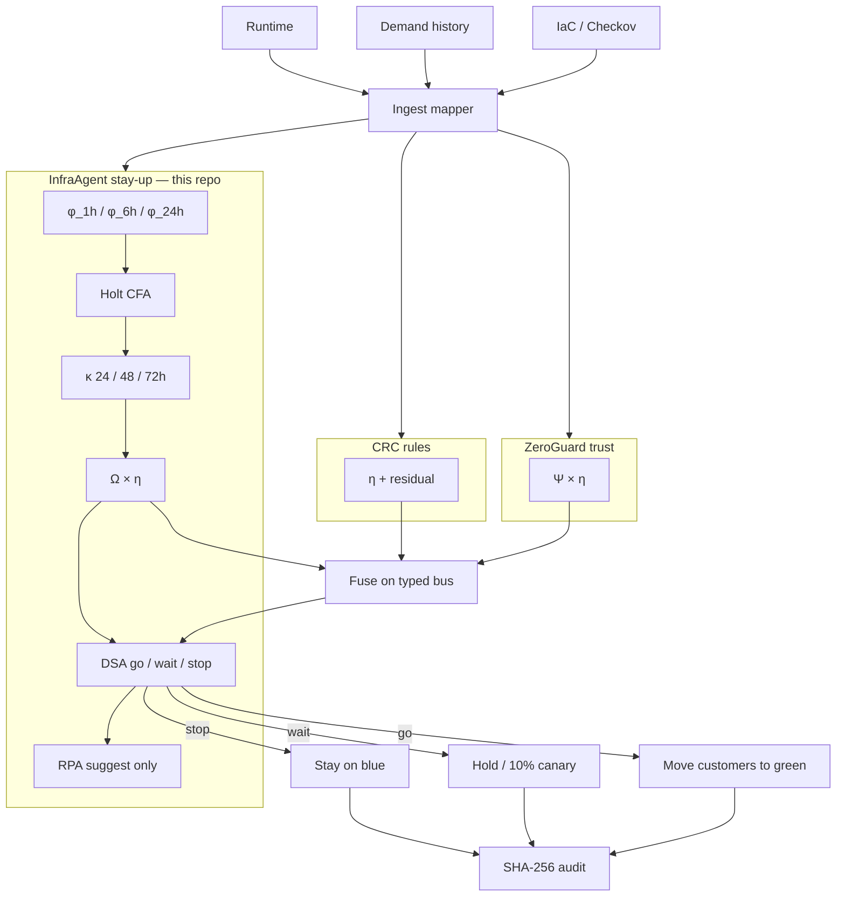
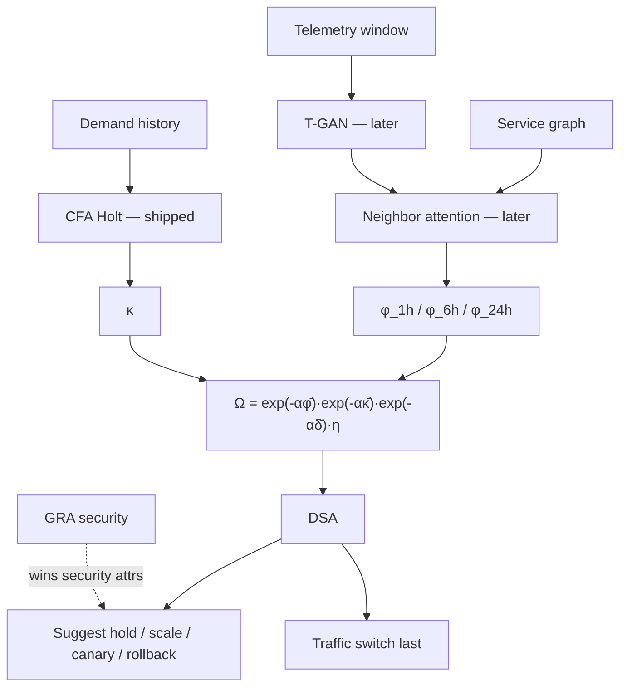
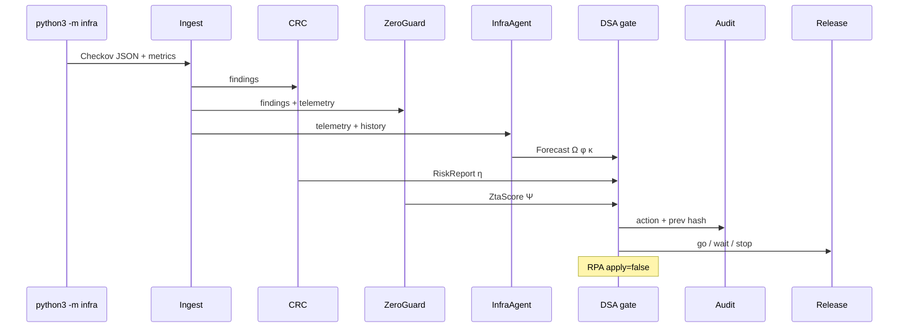

# Architecture — InfraAgent stay-up plane

GitHub: [harishapuri/infraagent](https://github.com/harishapuri/infraagent)

This repo owns the **stay-up** plane (InfraAgent, paper 1239). Question: will it fail soon, or will we run out of room?

Scoring still runs the **fused** gate. CRC η, ZeroGuard Ψ, and InfraAgent Ω share one bus and one go / wait / stop. `--focus` only changes what the CLI prints. Library source: [unifiedframework](https://github.com/harishapuri/unifiedframework) (vendored here as `vendor/unified_framework`).

Sibling planes: [CICD_Compliance](https://github.com/harishapuri/CICD_Compliance) (rules), [ZeroGuard](https://github.com/harishapuri/ZeroGuard) (trust).

## This repo in the loop

```
Checkov JSON + telemetry / demand history
                ↓
Ingest (vendor/unified_framework)
                ↓
InfraAgent φ, κ, Ω, DSA, suggest-only RPA   ← this plane
CRC η · ZeroGuard Ψ                         ← still computed
                ↓
Typed bus → DSA go / wait / stop
                ↓
Traffic switch LAST · SHA-256 audit · shadow unless --enforce
```

Traffic stays on **blue** unless the fused pick is go. RPA suggestions are never auto-applied.

## All in one — upstream to downstream



## InfraAgent complete flow (paper 1239)



**Shipped in this repo:** φ from error / cpu / p95 (rising history lifts φ_6h). κ from Holt on `history.demand` or snapshot deficit. Same DSA thresholds. RPA `apply = false`. `python3 -m infra --focus` prints stay-up plus the fused decision.

Hot traffic on a **clean** Checkov scan is the stay-up story: the pick should be **Undo** (`ROLLBACK`), not a green CRC-only pass.

## Gate (same join as unified)

```
η multiplies both Ψ and Ω.

BLOCK  if  φ_1h > 0.7  OR  residual-high  OR  critical IaC
WARN   if  φ_6h > 0.5  OR  any ZTA pillar < 0.5  OR  κ > 0.15
PASS   otherwise → ALLOW

Conflict: GRA owns security attributes; RPA owns traffic and capacity.
Autonomy α2: never auto-apply.
```

## One pipeline run



## Feedback loop

```
shadow pick  →  customers stay or move  →  record actual
     ok | incident | rollback | brownout
                    ↓
              scorecard → ready_for_enforce? → --enforce
```

## File map (this repo)

| Path | Role |
| --- | --- |
| `infra/cli.py` | Checkov + telemetry → orchestrator; `--focus` / `--enforce` |
| `infra/demo.py` | SSE site on http://127.0.0.1:8872/ |
| `infra/automate.py` | Headless seven stories |
| `vendor/unified_framework/framework/infraagent/` | φ, κ, Ω, DSA, RPA |
| `vendor/unified_framework/framework/ingest/telemetry.py` | Datadog / Prometheus aliases |
| `.github/workflows/gate.yml` | Tests + automate + shadow pass |
